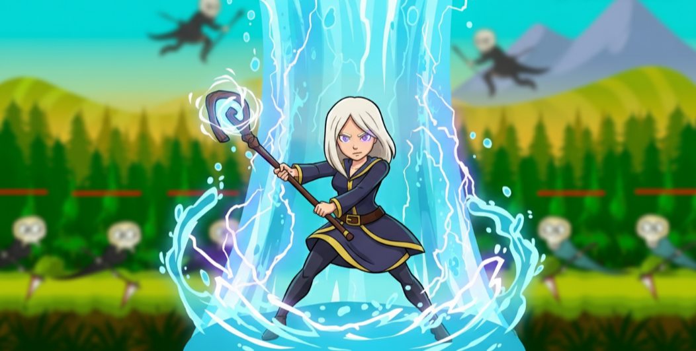
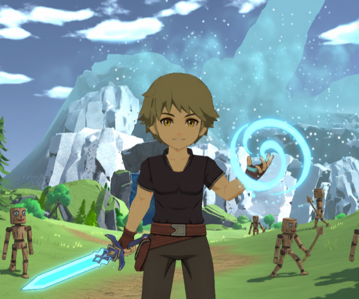

<h1 align="center">Hi, I'm Maksym 
  
</h1>

<h3 align="center">🎮 Unity Developer | 💻 C# Programmer</h3>

### 🧠 About Me
I’m a Unity developer focused on creating small 3D games and gameplay prototypes.  
Currently improving my skills in **C#**, **Unity**, and **game design**.  

## 🌐 Socials: 

# 💻 Tech Stack:
                                           
# 📊 GitHub Stats:

<h2 align="center">
    
  
  

</h2>

  
  

## 🏆 GitHub Trophies

### 🚀 Current Projects

#### 🦊 GeoFox
A mobile action game where the main character defends herself from waves of monsters.  
Developed in Unity for Android.  
*(Despite the name, there are no foxes involved 🦊😉)*

  
  

  

#### ⚔️ 3D RPG A third-person RPG prototype featuring basic combat, movement, and an early inventory system. 

  
  

  

